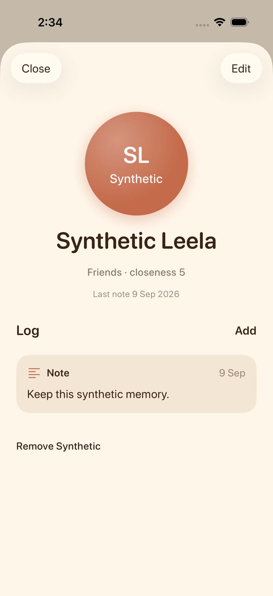
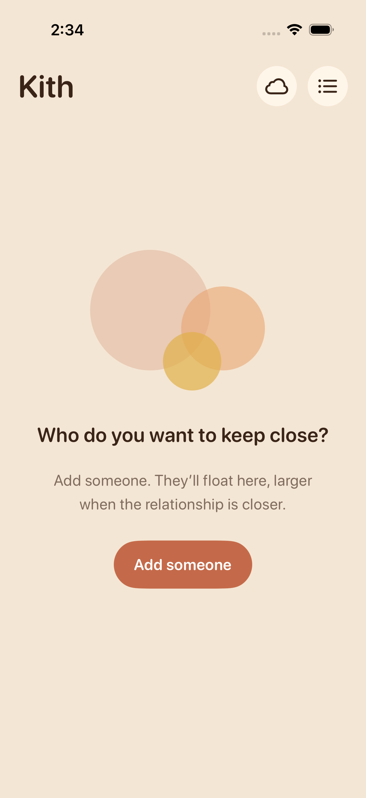

# Kith local persistence qualification — 9 September 2026

The actual rendered iPhone simulator journey passed on a UUID-scoped synthetic
JSON store. This is local use evidence; it does not qualify Google sign-in,
physical phone use, private iCloud convergence or public distribution. Installed
build 12 / source `34a6cae` was not changed. Issue 27 retains those gates.

## Journey and isolation

`KithUITests.testPersonAndMemoryEditsAndDeletionsSurviveRelaunch` creates Synthetic
Leela with closeness 4, adds two dated notes, edits closeness to 5, and terminates
and relaunches the process. It checks the edited value and both notes, selectively
deletes one note, relaunches again and checks the retained note and deleted note's
absence. It then removes the person and confirms the empty state after another
relaunch. A final cleanup launch removes only this UUID fixture directory.

The DEBUG-only `--ui-persistence-store <UUID>` composition uses a temporary file
and explicitly nil Hub and CloudKit connections. An invalid UUID fails instead
of falling back to the default store. Release initialization is unchanged. No
owner document, device, account, credentials or network synchronization was used.
No product defect was reproduced in this journey.

## Validation

- Focused XCUI test: passed first attempt, 72.8 seconds.
- Full suite: 44 passed, zero failed or skipped, including nine UI tests (118.9 seconds).
- Unsigned Release build: passed, stable Xcode 26.6; generated project unchanged.
- Simulator: `28E413D9-B587-41D3-9D7C-3D903BC6F842`, iOS 26.5.
- Existing native check's test/build stages were run through XcodeBuildMCP;
  XcodeGen regeneration also passed. Hosted CI is a separate exact-commit gate.

Retained original XCTest attachments were independently visually reviewed: person
name, closeness, date and retained note are readable; the final empty state is
readable. They are simulator evidence, not screenshots of the owner-installed app.

Machine-local audit artifacts:

- Focused result: `~/Library/Developer/XcodeBuildMCP/workspaces/kith-d11c1f630ba5/result-bundles/test_sim_2026-09-09T09-03-51-688Z_pid73864_7af625da.xcresult`
- Full result: `~/Library/Developer/XcodeBuildMCP/workspaces/kith-d11c1f630ba5/result-bundles/test_sim_2026-09-09T09-05-24-700Z_pid79500_68e15a62.xcresult`
- Release log: `~/Library/Developer/XcodeBuildMCP/workspaces/fleet-167b0b9d8f42/logs/build_sim_2026-09-09T09-09-01-126Z_pid87109_a0859c34.log`
