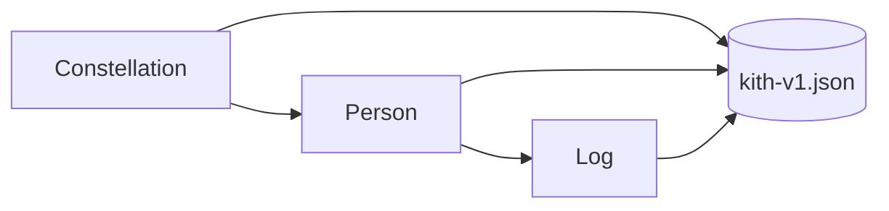

# Design

Kith is a single-document iPhone app.

- `KithDocument` owns `people` and `entries`. Mutations are methods on the
  document so they can be tested without SwiftUI.
- `KithStore` is an actor that reads and writes Application Support with
  complete file protection.
- `AppModel` is the `@MainActor` owner. `--ui-demo` and `--fresh-demo`
  replace the on-device file so tests never touch real notes.
- Bubble size is a pure function of closeness. The field is a small
  repulsion / wander simulation; reduced motion freezes it.

No backend, no CloudKit, no HealthKit.
